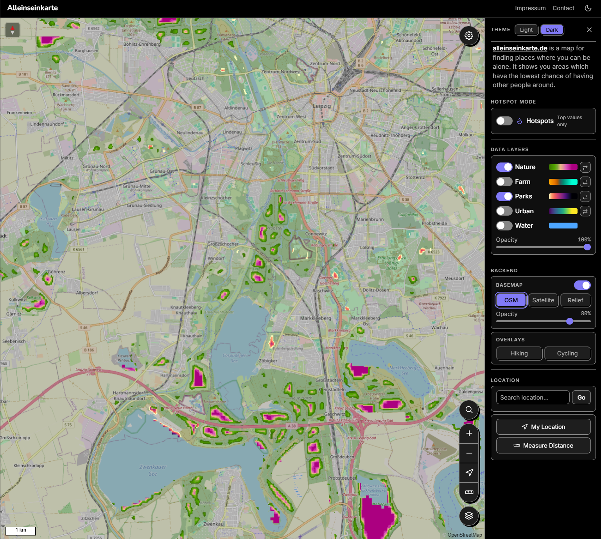
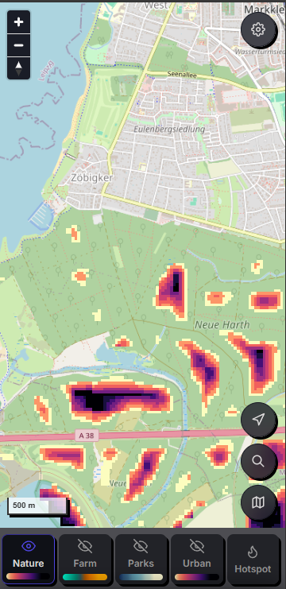
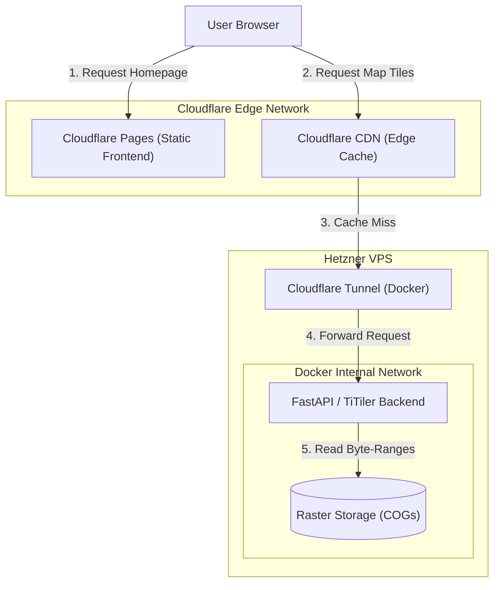
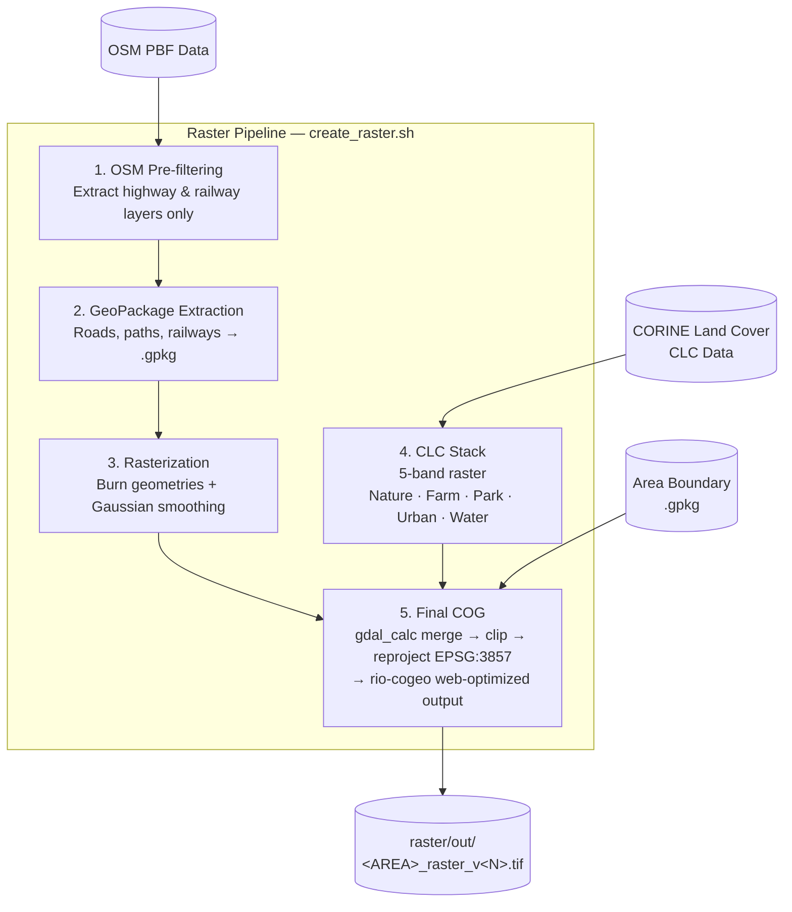

# [alleinseinkarte.de](https://alleinseinkarte.de)

[alleinseinkarte.de](https://alleinseinkarte.de) is a map for finding places where you can be alone. By visualizing areas where there is the lowest chance of meeting other people, it guides you to spots where you can escape and have a good time with yourself.

The project utilizes Cloud Optimized GeoTIFFs (COGs) served by a [Titiler](https://developmentseed.org/titiler/) backend via FastAPI, combined with a frontend using MapLibre and/or Leaflet.

| PC Layout                                              | Mobile Layout                                                  |
| ------------------------------------------------------ | -------------------------------------------------------------- |
|  |  |

# Table of Contents

- [Technical Features](#technical-features)
- [Production System Architecture](#production-system-architecture)
- [Raster Pipeline](#raster-pipeline)
- [How to Run Locally](#how-to-run-locally)
  - [Run Docker Container](#run-docker-container)
    - [How to Use in Production](#how-to-use-in-production)
- [Helper Scripts](#helper-scripts)
- [Documentation](#documentation)

# Technical Features

1. **Optimized Spatial Data Masking**: Instead of querying multiple overlapping rasters, the pipeline uses `gdal` to encode distinct CORINE land-cover classifications (Nature, Farm, Parks, Urban, Water) and OSM road proximity into different value-ranges in a single-band raster. The frontend decodes these bands in real-time.
2. **Cloud-Optimized GeoTIFFs (COGs)**: The pipeline outputs web-optimized COGs with built-in overviews and DEFLATE compression, aligned precisely to the Web Mercator tile grid using `rio-cogeo` for low-latency range requests.
3. **Cloudflare CDN Integration**: Caching rules absorb tile requests at the Edge. The Hetzner VPS is bypassed for any pre-rendered tiles.
4. **Outbound Tunnel Networking**: Host ports remain closed to the public internet; traffic is routed from Cloudflare using a secure dockerized tunnel agent (`cloudflared`).
5. **Tailscale VPN Integration**: Administrative services (SSH, development servers) bind to the private Tailnet, protecting the VPS from public discovery.
6. **Automated CI/CD**: Pre-commit hooks check code styles and static types. Version tags and changelogs are automatically calculated using Commitizen and pushed on branch merges.

# Production System Architecture

Static assets are served directly from the Edge, while dynamic tile requests are cached at the CDN Edge. Tile-Backend is routed over a Cloudflare Tunnel to a containerized Python backend.



For details, see the [Architecture Docs](docs/architecture.md), [VPS and System Setup](docs/vps_setup.md), [Cloudflare Tunnel & Caching](docs/cloudflare_setup.md)


# Raster Pipeline
The raster creation pipeline utilises Osmium, GDAL and Python-Scripts.
See details in [Raster Creation Pipeline](docs/raster_creation.md)




# How to Run Locally

To develop or test the application on your local machine, use `uv` for Python dependency management.

1. **Install dependencies**:

   ```bash
   uv sync --python 3.12
   ```

2. **Start the backend server**:

   ```bash
   uv run uvicorn backend.main:app --host 127.0.0.1 --port 8000 --reload
   ```

3. **Run Frontend**:
   ```bash
   npx --yes browser-sync start --server "frontend/static" --files "frontend/static/*.html" "frontend/static/*.css" "frontend/static/themes/*.css" "frontend/static/*.js" --port 5173 --no-ui --no-open --host 127.0.0.1
   ```


Once running:

- **Frontend URL**: `http://127.0.0.1:5173`
- **Backend URL**: `http://127.0.0.1:8000`
- **API Health Check**: `http://127.0.0.1:8000/healthz`

## Run Docker Container

Run the backend using Docker [docker-compose.yml](docker-compose.yaml).

1. **Build and Start**:
   ```bash
   docker compose up -d --force-recreate tiler
   ```
2. **Verify**:
   Container will run health-check you can see in the logs or
   ```bash
   curl http://localhost:8000/healthz
   # linux
   ./scripts/smoke-test.sh
   # Windows
   .\scripts\smoke-test.ps1
   ```

### How to Use in Production


1. **Deployment**:
   Git pull updates to the VPS.
2. **Re-Starting the Service**:
   ```bash
   ssh gregor@$IP_VPS "./scripts/docker.sh"
   ```
   _Environment variables and GDAL optimizations are set in docker-compose-yaml [VPS Setup](docs/vps_setup.md)._

# Helper Scripts

Each script has a Linux (`.sh`) and a Windows PowerShell (`.ps1`) variant with identical behaviour.


| Script                                | Description                                                                                                       |
| ------------------------------------- | ----------------------------------------------------------------------------------------------------------------- |
| `scripts/setup_dev.sh`                | First-time setup: installs GDAL and `uv`, runs `uv sync`, installs pre-commit hooks                               |
| `scripts/dev.sh` / `.ps1`             | Starts backend + frontend together; runs smoke test once backend is healthy                                       |
| `scripts/backend.sh` / `.ps1`         | Starts FastAPI/Uvicorn backend on port 8000                                                                       |
| `scripts/frontend.sh` / `.ps1`        | Starts the browser-sync frontend dev server on port 5173                                                          |
| `scripts/docker.sh` / `.ps1`          | Runs `docker compose up -d --force-recreate tiler` (containerised backend)                                        |
| `scripts/smoke-test.sh` / `.ps1`      | Hits `/healthz` and a sample tile endpoint; exits non-zero on any non-200 response                                |


---

## Documentation

Review the sub-documents in the `docs/` folder to understand specific platform integrations:

- [VPS and System Setup](docs/vps_setup.md)
- [Cloudflare Tunnel & Caching](docs/cloudflare_setup.md)
- [Tailscale Networking](docs/tailscale_setup.md)
- [Development Workflow (Commitizen & Actions)](docs/development_workflow.md)
- [Architecture & Sequence Diagrams](docs/architecture.md)
- [Raster Creation Pipeline](docs/raster_creation.md)
