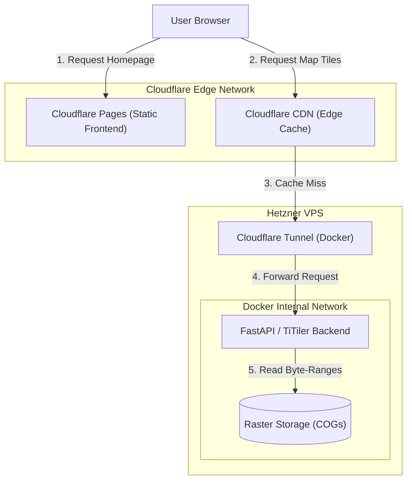

# alleinsein.de

alleinsein.de is a spatial web application designed to help users visualize and explore isolation or "aloneness" through map data. The project utilizes high-performance Cloud Optimized GeoTIFFs (COGs) served by a [Titiler](https://developmentseed.org/titiler/) backend via FastAPI, combined with a frontend using MapLibre and/or Leaflet.

|PC Layout |Mobile Layout |
|---|---|
| |  |


# Table of Contents
- [Scripts](#scripts)
- [Technical Features](#technical-features)
- [How to Run Locally](#how-to-run-locally)
  - [Running the Application](#running-the-application)
  - [Run Docker Container](#run-docker-container)
  - [How to Use in Production](#how-to-use-in-production)
- [Raster Generation](#raster-generation)
  - [Create Raster](#create-raster)
  - [Copy to server](#copy-to-server)
- [Production System Architecture](#production-system-architecture)
- [Documentation](#documentation)

# Scripts

Each script has a Linux (`.sh`) and a Windows PowerShell (`.ps1`) variant with identical behaviour.

**Development**

| Script | Description |
|---|---|
| `scripts/setup_dev.sh` | First-time setup: installs GDAL and `uv`, runs `uv sync`, installs pre-commit hooks |
| `scripts/dev.sh` / `.ps1` | Starts backend + frontend together; launches backend health |
| `scripts/backend.sh` / `.ps1` | Starts FastAPI/Uvicorn backend on port 8000 |
| `scripts/frontend.sh` / `.ps1` | Starts the browser-sync frontend dev server on port 5173 |
| `scripts/docker.sh` / `.ps1` | Runs `docker compose up --force-recreate tiler` (containerised backend) |
| `scripts/smoke-test.sh` / `.ps1` | Hits `/healthz` and a sample tile endpoint; exits non-zero on any non-200 response |
| `raster/create_raster.sh` | Full pipeline entry point — runs all four stages below in sequence |
| `raster/utils/cog_info.sh` | Prints file sizes and `rio cogeo info` for all COGs in `raster/out/` |
| `raster/utils/create_germany_mask.py` | Reads `input/bounds/germany.gpkg`, inverts it to a Germany mask and writes `frontend/static/germany-mask.geojson`  |

[Raster Creation Pipeline](docs/raster_creation.md) for a details

---


# Technical Features

1. **Optimized Spatial Data Masking**: Instead of querying multiple overlapping rasters, the pipeline uses `gdal` to encode distinct CORINE land-cover classifications (Nature, Farm, Parks, Urban, Water) and OSM road proximity into different value-ranges in a single-band raster. The frontend decodes these bands in real-time, reducing server reads by 5x.
2. **Cloud-Optimized GeoTIFFs (COGs)**: The pipeline outputs web-optimized COGs with built-in overviews and ZSTD compression, aligned precisely to the Web Mercator tile grid using `rio-cogeo` for low-latency range requests.
3. **Cloudflare CDN Integration**: Caching rules absorb tile requests at the Edge. The Hetzner VPS is bypassed for any pre-rendered tiles.
4. **Outbound Tunnel Networking**: Host ports remain closed to the public internet; traffic is routed from Cloudflare using a secure dockerized tunnel agent (`cloudflared`).
5. **Tailscale VPN Integration**: Administrative services (SSH, development servers) bind to the private Tailnet, protecting the VPS from public discovery.
6. **Automated CI/CD**: Pre-commit hooks check code styles and static types. Version tags and changelogs are automatically calculated using Commitizen and pushed on branch merges.


# How to Run Locally

To develop or test the application on your local machine, we use `uv` for Python dependency management.

1. **Install dependencies**:
   ```bash
   uv sync --python 3.12
   ```

2. **Start the backend server**:
   ```bash
   uv run uvicorn backend.main:app --host 127.0.0.1 --port 8000 --reload
   ```

3. **Run Frontend**:
   ```bash
   npx --yes browser-sync start --server "frontend/static" --files "frontend/static/*.html" "frontend/static/*.css" "frontend/static/themes/*.css" "frontend/static/*.js" --port 5173 --no-ui --host 172.0.0.1
   ```
   

## Running the Application
Launch both the backend API and the frontend server and run auto-healthcheck

**Linux**
```bash
./scripts/deploy_locally.sh
```

**Windows (PowerShell):**
```powershell
 .\scripts\deploy_locally.ps1
```

Once running:
- **Frontend URL**: `http://127.0.0.1:5173`
- **Backend URL**: `http://127.0.0.1:8000`
- **API Health Check**: `http://127.0.0.1:8000/healthz`


## Run Docker Container

Run the backend using Docker [docker-compose.yml](docker-compose.yaml).

1. **Build and Start**:
   ```bash
   docker compose up --force-recreate tiler
   ```
2. **Verify**:
   Container will run health-check you can see in the logs or
   ```bash
   curl http://localhost:8000/healthz
   # linux
   ./scripts/smoke-test.sh   
   # Windows
   .\scripts\smoke-test.ps1
   ```

## How to Use in Production
Details about [architecture](#production-system-architecture)
1. **Deployment**:
   Git pull updates to the VPS.
2. **Re-Starting the Service**:
   ```bash
   ssh gregor@$IP_VPS "./scripts/deploy_backend.sh"
   ```
   *Environment variables and GDAL optimizations are set in docker-compose-yaml [VPS Setup](docs/vps_setup.md).*

---

# Raster Generation

The raster pipeline is driven by [raster/create_raster.sh](raster/create_raster.sh). It runs four stages in sequence:

1. **GeoPackage extraction** — exports roads, paths, and railways from OSM data into `.gpkg` files.
2. **Rasterization** — burns road/path/railway lengths into a raster and applies Gaussian smoothing.
3. **CLC stack** — builds a 5-band CORINE land-cover raster (Nature, Farm, Park, Urban, Water).
4. **Final COG** — combines the roads heatmap and CLC bands into a single-band raster using `gdal_calc`, clips to the area boundary, reprojects to Web Mercator (EPSG:3857), and writes a web-optimized COG via `rio-cogeo`.

The output is written to `raster/out/` as `<AREA>_raster_v<N>.tif`, auto-incrementing the version number.
## Create Raster

See details in [Raster Creation Pipeline](docs/raster_creation.md)

### Run
```bash
# install enviroment
uv sync
# enter enviroment
source .venv/bin/activate
# run script
bash raster/create_raster.sh
```
### Config
To use a custom config file:
```bash
RASTER_CONFIG_FILE=/path/to/custom.conf bash raster/create_raster.sh
```
Set `OVERWRITE="--overwrite"` in `raster.conf` to force overwrite of existing intermediate files.

## Copy to server

Copy your locally generated raster files to the production environment using `scp` (with tailscale). 


```bash
scp ./raster/out/* gregor@$IP_VPS:/home/gregor/alone/raster/out/
```


# Production System Architecture

The project leverages a modern cloud-native architecture. Static assets are served directly from the Edge, while dynamic tile requests are cached at the CDN Edge, routing cache misses securely over a Cloudflare Tunnel to a containerized Python backend.



For details, see the [Architecture Docs](docs/architecture.md), [VPS and System Setup](docs/vps_setup.md), [Cloudflare Tunnel & Caching](docs/cloudflare_setup.md)


## Documentation

Review the sub-documents in the `docs/` folder to understand specific platform integrations:

- [VPS and System Setup](docs/vps_setup.md)
- [Cloudflare Tunnel & Caching](docs/cloudflare_setup.md)
- [Tailscale Networking](docs/tailscale_setup.md)
- [Development Workflow (Commitizen & Actions)](docs/development_workflow.md)
- [Architecture & Sequence Diagrams](docs/architecture.md)
- [Raster Creation Pipeline](docs/raster_creation.md)

