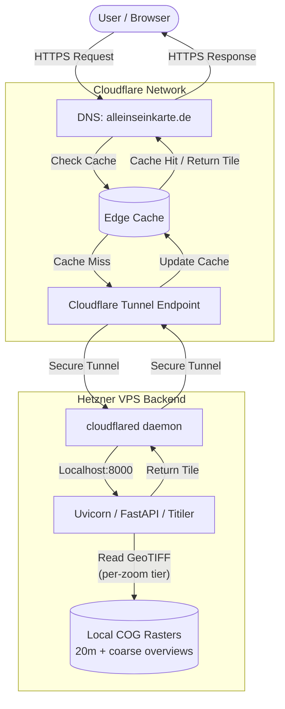
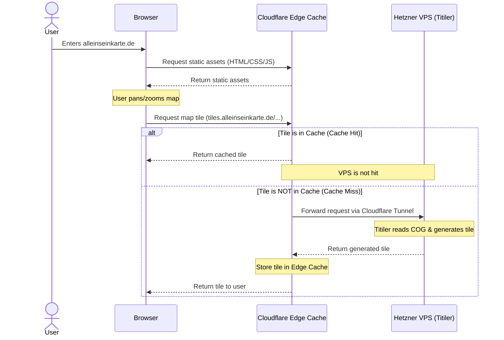

# Architecture and Sequence Diagrams

## System Architecture

This diagram illustrates the high-level architecture of the Alleinseinkarte project, detailing the interaction between the frontend, Cloudflare, the Hetzner VPS backend, and the mapping data.

### Per-zoom raster tiering

The backend does not serve a single raster. `backend/main.py` maps each incoming tile zoom to a resolution-appropriate COG (`Settings.raster_tiers`, coarsest-first). See the zoom→file mapping in the [Raster Creation Pipeline](raster_creation.md#coarse-overview-rasters-create_coarse_rastersh).

## Request Sequence Diagram

This sequence diagram details the step-by-step flow of a request originating from the user accessing the homepage and requesting a map tile. It highlights how the caching layer intercepts requests to prevent unnecessary load on the backend.

