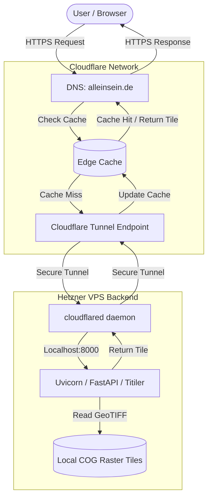
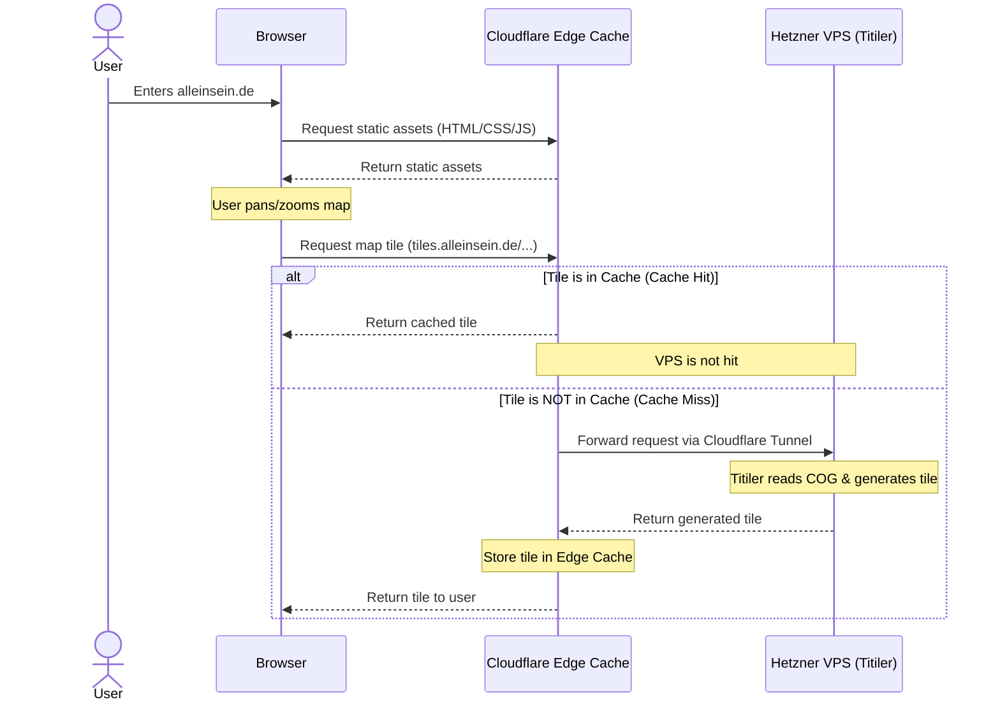
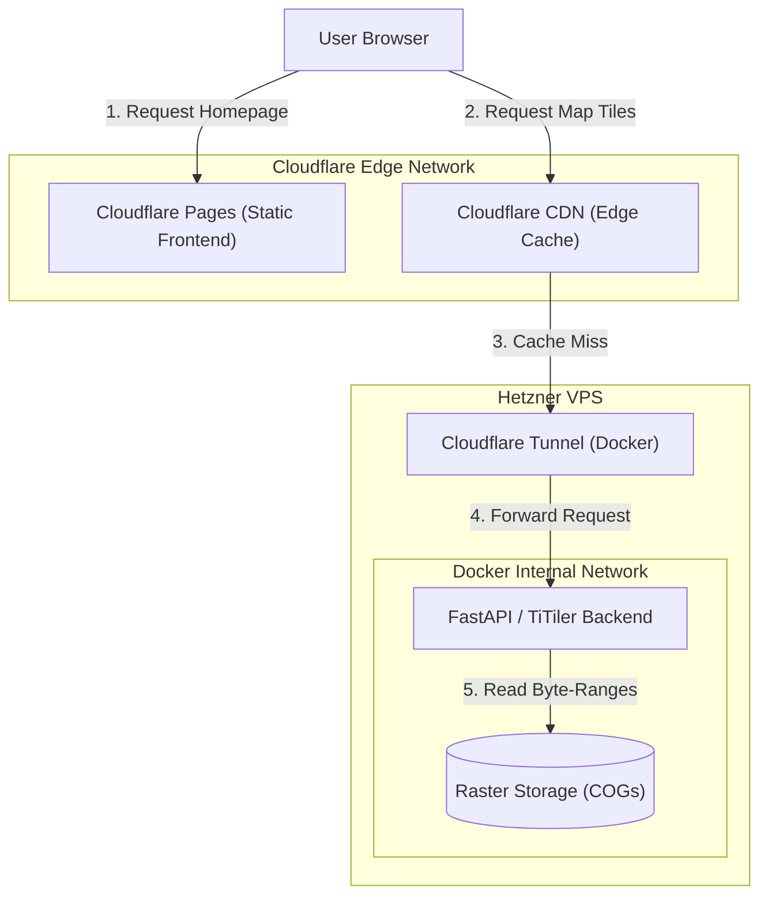
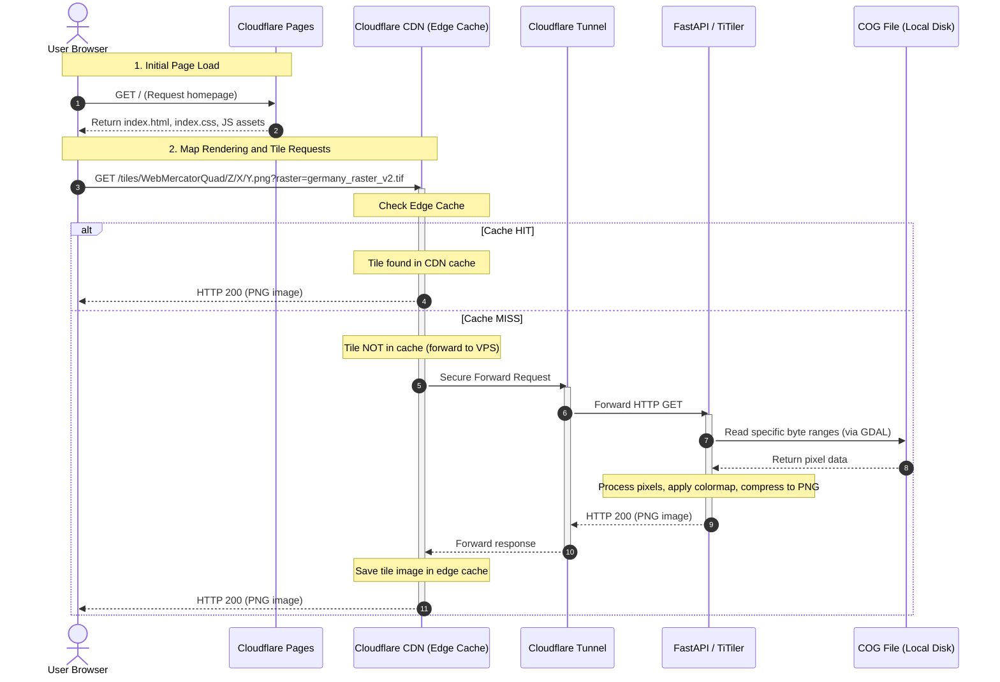

# Architecture and Sequence Diagrams

## System Architecture

This diagram illustrates the high-level architecture of the Alleinsein project, detailing the interaction between the frontend, Cloudflare, the Hetzner VPS backend, and the mapping data.

## Request Sequence Diagram

This sequence diagram details the step-by-step flow of a request originating from the user accessing the homepage and requesting a map tile. It highlights how the caching layer intercepts requests to prevent unnecessary load on the backend.

# Architecture & Request Flow Diagrams

This document contains Mermaid.js diagrams illustrating the system architecture and request lifecycle of the `alleinsein` application.

---

## 1. System Architecture

The infrastructure uses Cloudflare to serve static content and cache dynamic map tiles, while a secure Cloudflare Tunnel routes cache misses to a containerized FastAPI backend running on a Hetzner VPS.

---

## 2. Request Sequence Diagram

This sequence diagram displays what happens when a user accesses the site, showing both the static asset load path and the conditional cache/VPS path for tile queries.

